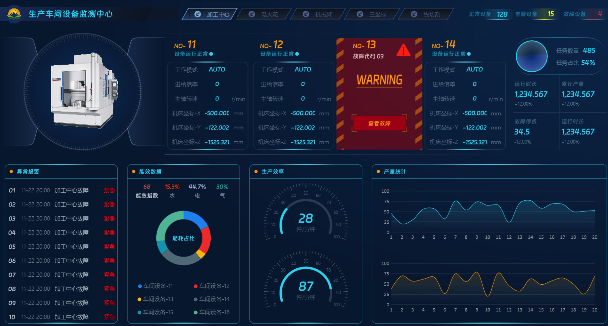

# Device Dashboard

## Build and Run

### NuGet Packages

- liveCharts.wpf
- CommunityToolkit.Mvvm
- S7netplus

## UI

### Breakdown

## Presentation

### Device Info

#### Device info pool (Model)

### Production Statistics
PLC communication: A monitor thread to collect device data and store in data pool.
